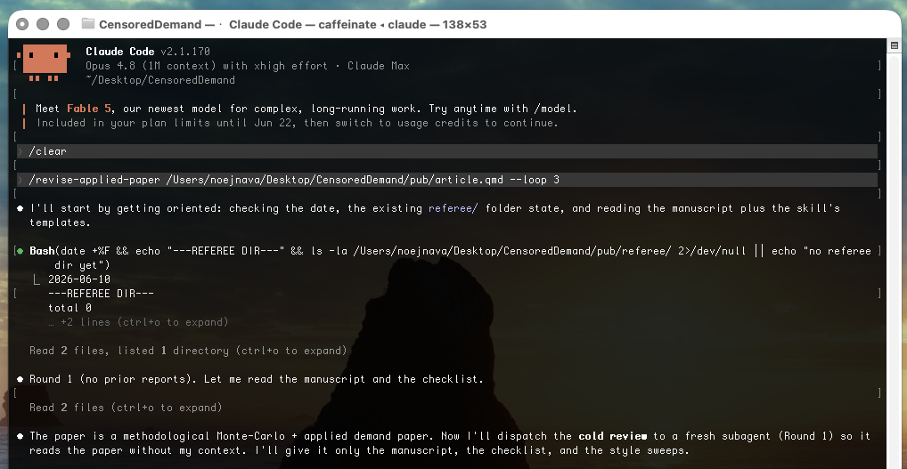
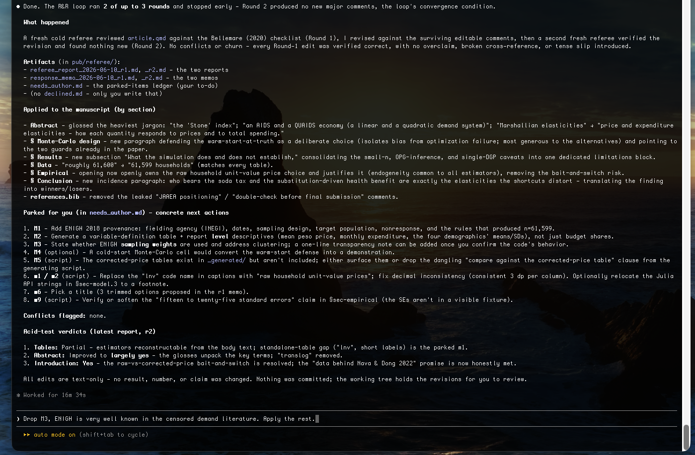

# revise-applied-paper

A [Claude Code](https://claude.com/claude-code) skill that referees and revises an applied
economics paper (`.qmd`, `.md`, or `.tex`) against Marc F. Bellemare's
*[How to Write Applied Papers in Economics](http://marcfbellemare.com/wordpress/)* (2020).

> [!IMPORTANT]
> **This is a writing-craft tool, not scientific peer review.** It helps the *practitioner*
> write a better paper by checking the manuscript against Bellemare's recommendations on
> structure, exposition, and presentation — does the introduction follow Head's formula, is the
> data section complete, are the tables self-explanatory, does the abstract read for a general
> audience. The "referee report" it produces is about **how the paper is written**, not about
> whether the economics is correct. It does **not** judge the validity of your identification,
> the soundness of your model, the correctness of your results, or the merit of your
> contribution. Treat its output as an editor's read for clarity and convention — never as a
> verdict on the scientific or academic substance of the work. That judgment remains yours and
> your actual referees'.

## What it does

Applied papers get rejected for avoidable writing reasons — a buried research question, a thin
data section, an introduction that overpromises, tables a reader can't reconstruct. Bellemare
(2020) wrote down the unspoken norms that prevent this. This skill turns those norms into a
repeatable check on your own draft, structured as a journal R&R.

## How it works

Three steps, simulating a round of review:

1. **Cold review** — a fresh subagent reads your manuscript *without* your conversation context
   (like a real referee who didn't watch you write it) and audits it against an ~80-item
   checklist distilled from Bellemare (2020).
2. **Referee report** — the findings are written up as a referee report — a summary of the paper,
   numbered **major** comments (structure, data provenance, bait-and-switch, overclaiming) and
   **minor** comments (tense, notation, tables, abstract polish) — and saved next to your paper.
3. **Revise** — editing-level comments are applied to the manuscript; substantive ones that need
   new analysis or your judgment are *parked* in a to-do ledger (never fabricated); every comment
   is answered in a response memo.

Run it once **interactively** (it shows you the report and lets you strike items before any edit),
or in **loop mode** (`--loop N`) where it runs several autonomous rounds — each new round verifies
the previous round's fixes and stops when a round raises no new major comments.

Everything persists in a `referee/` folder beside your paper, so the reports are diffable across
drafts and double as a rehearsal for your real response-to-reviewers later:

```
referee/
├── referee_report_<date>_r1.md   # one per round
├── response_memo_<date>_r1.md    # every comment → applied / parked / declined
├── needs_author.md               # substantive items only you can address
└── declined.md                   # items you struck, with your reason
```

## Usage

```bash
/revise-applied-paper article.qmd            # one interactive round
/revise-applied-paper article.qmd --loop 3   # up to 3 autonomous rounds
```

It also triggers automatically when you ask things like *"review my introduction"* or *"check
this draft against applied-econ norms."*

## Example — a real run

Run on an actual working paper (*"The cost of common simplifications in censored demand-system
estimation"*), in loop mode with a cap of three rounds.

### 1. One command, loop engaged

The skill dispatches a fresh cold referee for Round 1 — it reads only the manuscript, the
checklist, and the style sweeps, with none of the author's chat context.



### 2. The loop converges and reports back

The loop ran **2 of up to 3 rounds and stopped early** — Round 2's referee verified every Round-1
edit and found no new major comments. The summary lists what was applied to the manuscript by
section, and what was parked for the author. Real comments from the report behind this run:

> **M1. Data provenance is incomplete for a real-survey application.** §sec-data names "ENIGH 2018"
> and "roughly 61,600 households" but gives no fielding agency, collection dates, sampling design,
> or the rules that produced n=61,599. *Fixable by editing: no — needs the author's knowledge.*

> **M5. Raw-vs-corrected price framing risks a bait-and-switch.** The abstract promises "the real
> ENIGH 2018 data behind Nava & Dong (2022)," but the body presents only raw unit-value results and
> a table caption points to a corrected-price comparison the body never shows.

> **m3.** [abstract] Dense with unglossed jargon for a non-economist — "Tobit," "Stone price index,"
> "translog," "QUAIDS," "bias floor" → lightly gloss the most technical terms.



### 3. You stay in control

The report is a checkpoint, not an autopilot. Here the author declines one comment —
*"Drop M3, ENIGH is very well known in the censored demand literature"* — and it's recorded in
`declined.md` with that reason while the rest are applied. Note the skill **read the actual repo
rather than fabricating**, which surfaced a real finding, and it changed only prose — *"no estimate,
number, or claim was changed anywhere."*


What landed in the manuscript were writing fixes (provenance paragraph, a variable-definition table,
plain-English variable names, glossed abstract, a consistent decimal format). What it would *not*
touch — and parked for the author instead — were things requiring new analysis or judgment
(regenerating tables, a cold-start Monte-Carlo, the weighting decision). That line is exactly the
point of the disclaimer above.

## Installation

The skill must live in `~/.claude/skills/` to be active. Clone it there, or clone anywhere and
symlink:

```bash
git clone git@github.com:noejn2/revise-applied-paper.git
ln -s "$(pwd)/revise-applied-paper" ~/.claude/skills/revise-applied-paper
```

Then `/revise-applied-paper <your-draft>` in any project.

## Repo layout

```
revise-applied-paper/
├── SKILL.md                       # the skill: workflow + interactive/loop modes
├── references/
│   ├── bellemare-checklist.md     # the ~80-item audit, distilled from the paper
│   └── bellemare-fulltext.txt     # full text, for when original wording is needed
└── assets/
    ├── referee-report-template.md # fixed report format
    ├── response-memo-template.md  # fixed memo format
    └── BellemareHowToPaperSeptember2020.pdf
```

## Credit

All of the substance here is Marc F. Bellemare's. The checklist is a distillation of his
*How to Write Applied Papers in Economics* (September 2020), a chapter from his book
*Doing Economics* (MIT Press). For the real thing, read the
[original paper](http://marcfbellemare.com/wordpress/) and his
[blog](http://marcfbellemare.com/wordpress/) on academic writing — and Keith Head's
[Introduction Formula](https://blogs.ubc.ca/khead/research/research-advice/formula), which it
relies on.
